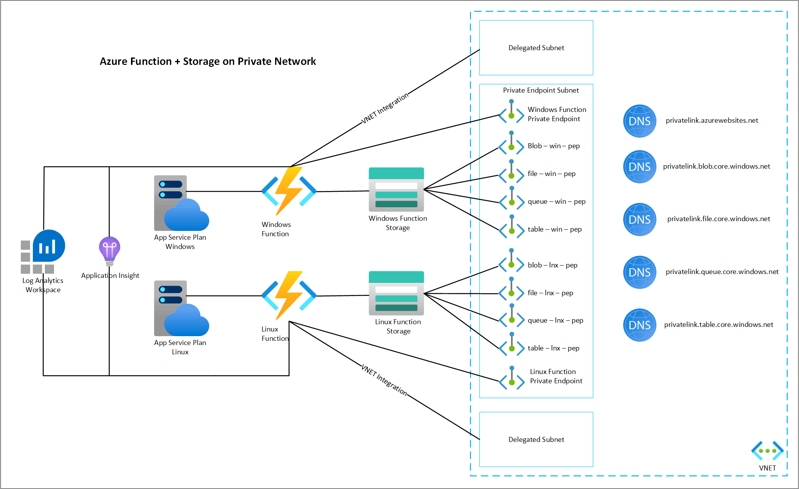

# Azure Function App
  

## Architecture Overview
This Terraform module creates a Linux and Windows Function App with its corresponding storage account on a Private Virtual Network. When you deploy a Function App on the Consumption App Service Plan(the least expensive option), its Function App and storage account are accessible from the Internet. For better security and access control, enterprises would prefer having both on a private network.  To have a private network option, a Dedicated Plan like a Premium App Service plan is required.  If there is a need to expose the function to the internet, you may want to consider placing an Azure API Management or Application Gateway in front of the function.

## Dependencies

In the dependency-components.tf file you will find all the Azure resources that are required, as they will the input into the module. The following table outlines the components created.

| Component Name                    | Azure Resource         | Usage           |
| ----------------------------------| -----------------------| --------------- |
| vnet-prod                         | Virtual Network        | Create a vNet to privatize connections|
| snet-private-endpoint             | Subnet                 | Subnet for Private Endpoint used for Function Inbound Traffic|
| snet-func-win                     | Subnet                 | Subnet for Outound Traffic from Function, Delegated for Windows App Service Plan|
| snet-func-lnx                     | Subnet                 | Subnet for Outound Traffic from Function, Delegated for Linux App Service Plan|
| planx-funclnx-001                 | App Service Plan       | App Service Plan used by Linux Function|
| planx-funcwin-001                 | App Service Plan       | App Service Plan used by Windows Function|
| law-funcprivate                   | Log Analytics Workspace| Log Analytics workspaces to capture all logs|
| aai-funcprivate                   | Application Insights   | Application Insights for both functions|
| privatelink.blob.core.windows.net | Private DNS Zone       | Private DNS Zones to resolve Storage Blob Private Endpoint|
| privatelink.table.core.windows.net| Private DNS Zone       | Private DNS Zones to resolve Storage Table Private Endpoint|
| privatelink.queue.core.windows.net| Private DNS Zone       | Private DNS Zones to resolve Storage Queue Private Endpoint|
| privatelink.file.core.windows.net | Private DNS Zone       | Private DNS Zones to resolve Storage File Private Endpoint|
| privatelink.azurewebsites.net     | Private DNS Zone       | Private DNS Zones to resolve Function Private Endpoint|

## Supported Terraform Version

| Module version | Terraform version | AzureRM version |
| -------------- | ----------------- | --------------- |
| 1.0.0          | >=1.x.x           | >= 3.4          |

## Modules

| Name | Source | Version |
|------|--------|---------|
| Private Linux Azure Function | ./modules/az-function-lnx | 1.0.0 |
| Private Windows Azure Function | ./modules/az-function-win | 1.0.0 |

## Examples and usage

1. In the Terraform file "main.tf" update the local variables with different names, as some names need to be unique. 
2. Contributor and User Access Administrator IAM rights are required on the subscription. 
3. Deploy using standard Terraform commands

        az login
        az account set -s <subscription  id>
        terraform init
        terraform plan
        terraform apply
4. For Linux Function App, example module usage is shown in function-lnx.tf
5. For Windows Function App, example module usage is shown in function-win.tf
6. Once deployed, if you set up a simple HTTP trigger and try it over the internet, you will receive an "Error 403 - Forbidden", as expected. To test a private connection, you will need to deploy a test VM in the same VNET and then try the HTTP trigger.

Over The Internet

Over Private Network

## Linux

./modules/az-function-lnx
- Uses azurerm azurerm_linux_function_app
- Linux function requires a Linux App Service Plan
- Linux supports the following options, so you have to provide the version of the application stack you want to use when calling the module.
      python_version = var.python_version		Possible values include 3.6, 3.7, 3.8, and 3.9
      dotnet_version = var.dotnet_version		Possible values include 3.1 and 6.0
      node_version   = var.node_version1		Possible values include 12, 14, and 16.

## Windows

./modules/az-function-win
- Uses azurerm azurerm_windows_function_app
- Windows function requires a Windows App Service Plan
- Windows supports the following options, so you have to provide the version of the application stack you want to use when calling the module.
      java_version   = var.java_version		Supported versions include 8, and 11
      dotnet_version = var.dotnet_version     	Possible values include 3.1 and 6
      node_version   = var.node_version		Possible values include ~12, ~14, and ~16

## Inputs

| Name | Description | Type | Required | Windows/Linux |
|------|-------------|------|---------|:--------:|
| resource_group_name| Name or resource Group | `string` | yes | both |
| location| Location of resources and resource group | `string` | yes | both |
| azurerm_app_service_id| App Service Plan ID for either Windows or Linux | `string` | yes | OS Specific |
| pep_name | Name of Private End Point for Function App | `string` | yes | both |
| pep_subnet_id | Subnet ID for Private EndPoint Subnet | `string` | yes | both |
| swift_subnet_id | Function Swift Subnet ID - Function Outbound | `string` | yes | both |
| func_dns_id| Private DNS ID for privatelink.azurewebsites.net | `string` | yes | both |
| file_dns_id| Private DNS ID for privatelink.file.core.windows.net | `string` | yes | both |
| blob_dns_id| Private DNS ID for privatelink.blob.core.windows.net | `string` | yes | both |
| queue_dns_id| Private DNS ID for privatelink.queue.core.windows.net | `string` | yes | both |
| table_dns_id| Private DNS ID for privatelink.table.core.windows.net | `string` | yes | both |
| func_app_storage_name| Unique name of Storage Account for the Function| `string` | yes | both |
| storage_account_networksetting| Storage Account Network Setting - Set to Deny | `bool` | yes | both |
| log_analytics_ws_id| Log Analytics Workspace ID | `string` | no | both |
| func_diag_logs| Function Category details for Azure Diagnostic setting | `list` | yes | both |
| func_name| Name of Function App | `string` | yes | both |
| functions_extension_version| The runtime version associated with the Function App | `string` | yes | both |
| application_insights_connection_string| App Insight connection string | `string` | no | both |
| application_insights_key| App Insight Key | `string` | no | both |
| dotnet_version| The version of .NET to use. Possible values include 3.1 and 6 | `number` | at least 1 | both |
| java_version| The Version of Java to use. Supported versions include 8, and 11 | `number` | at least 1 | both |
| node_version| The version of Node to run. Possible values include (Windows:~12, ~14, and ~16)(Linux:12, 14, and 16) | `number` | at least 1 | both |
| python_version | The version of Python to run. Possible values include 3.6, 3.7, 3.8, and 3.9 | `number` | at least 1 | Linux |

## Outputs

| Name | Description | Windows/Linux |
|------|-------------|---------------|
| linux_function_identity_id | Managed Identity ID for Linux Function App | Linux |
| linux_function_id | Linux Function App ID | Linux |
| linux_function_storage_account_id | Storage Account for Linux Function ID | Linux |
| windows_function_identity_id | Managed Identity ID for Windows Function App | Windows |
| windows_function_id | Windows Funciton App ID | Windows |
| windows_function_storage_account_id | Storage Account for Windows Function ID | Windows |

## Related documentation

Microsoft Azure Functions documentation: [Link](https://github.com/Azure/Azure-Functions#documentation-1)

Azure Functions networking options: [Link](https://docs.microsoft.com/en-us/azure/azure-functions/functions-networking-options?tabs=azure-cli)

Use managed identity for AzureWebJobsStorage: [Link](https://docs.microsoft.com/en-us/azure/azure-functions/functions-identity-based-connections-tutorial#use-managed-identity-for-azurewebjobsstorage-preview)

Terraform Windows Function App: [Link](https://registry.terraform.io/providers/hashicorp/azurerm/latest/docs/resources/windows_function_app)

Terraform Linux Function App: [Link](https://registry.terraform.io/providers/hashicorp/azurerm/latest/docs/resources/linux_function_app)
